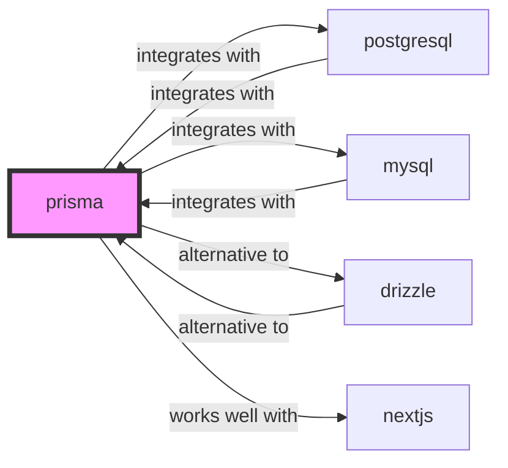

# Prisma Skill

> Next-generation Node.js and TypeScript ORM.

## Ecosystem Graph Preview



## Recommended Next Skills

- **[drizzle](/skills/drizzle)** (Score: 0.92)
  *Why: Direct relationship, Both are Databases, Shared ecosystem (typescript), Can deploy to vercel, Similar network profile*
- **[mysql](/skills/mysql)** (Score: 0.73)
  *Why: Direct relationship, Both are Databases, Similar network profile*
- **[postgresql](/skills/postgresql)** (Score: 0.73)
  *Why: Direct relationship, Both are Databases, Similar network profile*

## Quick Start
Prisma provides an intuitive data model definition format and auto-generates a fully type-safe database client.

```bash
npm install prisma --save-dev
npx prisma init
```

## Production Patterns
### Migration Workflows
Never run `npx prisma db push` in production. Always use `npx prisma migrate deploy` to ensure a strict, version-controlled history of schema changes executes atomically.

## Architecture & Scaling
### The Rust Query Engine
Prisma uses a Rust query engine running as a sidecar process. This provides advanced features but increases memory footprint and serverless cold starts. Ensure you use `@prisma/client/edge` if deploying to Edge runtimes.

## Error Recovery
Handle `PrismaClientKnownRequestError` specifically to catch and gracefully resolve common constraints (e.g., catching code `P2002` for unique constraint violations during user registration).

## Security Notes
Do not expose Prisma Studio (`npx prisma studio`) to the public internet. It provides full root access to your database.

## References
- [Prisma Docs](https://www.prisma.io/docs/)
