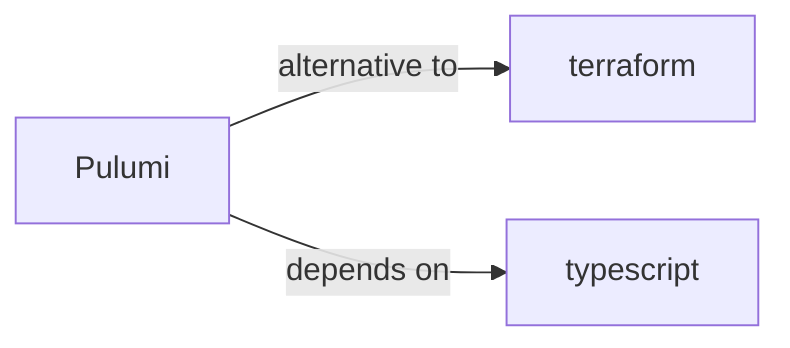

# Pulumi Skill

> Universal Infrastructure as Code.

## Ecosystem Graph



## Quick Start
Pulumi allows you to write Infrastructure as Code using general-purpose programming languages (TypeScript, Python, Go) instead of proprietary domain-specific languages like HCL.

```bash
npm install @pulumi/pulumi @pulumi/aws
pulumi up
```

## Production Patterns
### Programmatic Generation
Because Pulumi uses real code, you can easily use loops to generate 50 identical S3 buckets with slightly varying names, or fetch data from an external API to determine resource configurations dynamically during deployment.

## Architecture & Scaling
### Micro-Stacks
Instead of one massive Pulumi project, split your infrastructure into independent Stacks (e.g., `CoreNetwork`, `Database`, `Frontend`). Use Stack References (`new pulumi.StackReference`) to pass outputs (like VPC IDs) between them safely.

## Error Recovery
If Pulumi hangs during an update, you can manually cancel it and use `pulumi stack export` to inspect the raw JSON state, fix any corrupted resource IDs, and `pulumi stack import` the corrected state back.

## Security Notes
Pulumi natively supports secret management (`pulumi config set --secret`). Secrets are encrypted in the state file. When writing TypeScript, these secrets are returned as `Output<string>` types which cannot be accidentally logged as plaintext.

## Relationships
**Prerequisites**: [typescript](/skills/typescript)

**Alternatives**: [terraform](/skills/terraform)

## References
- [Pulumi Docs](https://www.pulumi.com/docs/)

## Why use this skill
Use this when your agent works with **pulumi** — structured patterns beat pasted docs and prevent common hallucinations.

## AI pitfalls
- Referencing CLI flags or config keys that do not exist
- Using outdated major versions of tools
- Skipping lockfile or version pinning in examples

## Production checklist
- [ ] Secrets in environment variables, not source code
- [ ] Error handling and logging in place
- [ ] Rate limits and timeouts configured

## Related skills
- [`terraform`](../terraform/SKILL.md) — alternative to
