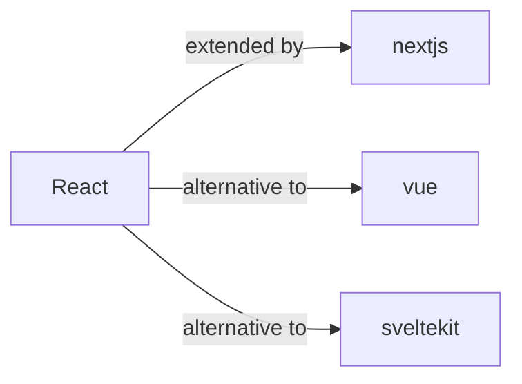

# React Skill

> The library for web and native user interfaces.

## Ecosystem Graph



## Quick Start
React 18 introduced concurrent rendering. While you can build raw SPAs, the React team officially recommends utilizing full-stack frameworks (Next.js, Remix) to handle routing, data fetching, and SSR.

```bash
npm install react react-dom
```

## Production Patterns
### Custom Hooks
Abstract complex component logic into custom hooks (`useAuth`, `useTable`). This decouples UI from business logic, making the hooks highly testable independently of the DOM.

## Architecture & Scaling
### Context vs State Managers
Do not use React Context for rapidly changing, high-frequency state (like mouse coordinates or typing inputs), as it forces a re-render of all consuming components. Use Zustand or Redux for complex global state, and Context strictly for static/slow-changing data (Themes, Auth Tokens).

## Error Recovery
Wrap critical UI sections in Error Boundaries to prevent a single component crash from unmounting the entire application tree.

## Security Notes
React natively escapes string variables to prevent XSS. However, using `dangerouslySetInnerHTML` bypasses this protection. Always sanitize HTML on the server or use a library like `DOMPurify` before injecting raw HTML.

## Relationships
**Alternatives**: [vue](/skills/vue), [sveltekit](/skills/sveltekit)

## References
- [React.dev](https://react.dev/)
