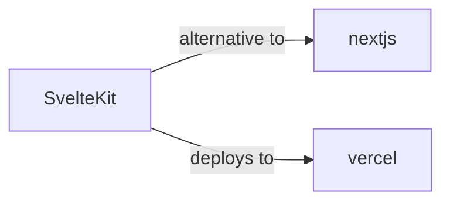

# SvelteKit Skill

> Web development, streamlined.

## Ecosystem Graph



## Quick Start
SvelteKit compiles away the framework. Instead of a virtual DOM, it generates highly optimized vanilla JavaScript. It uses a file-based routing system (e.g., `+page.svelte` and `+page.server.ts`).

```bash
npm create svelte@latest my-app
```

## Production Patterns
### Form Actions
SvelteKit heavily utilizes native HTML forms for mutations. Write a `default` action in `+page.server.ts` to handle POST requests, interact with your database, and return validation errors seamlessly without requiring client-side `fetch`.

## Architecture & Scaling
### Load Functions
Use `+page.server.ts` to export a `load` function. This function runs strictly on the server, fetching database records securely, and passes the resolved props directly to the `+page.svelte` component during SSR.

## Error Recovery
Throw `error(404, 'Not found')` from your load functions. SvelteKit automatically renders the nearest `+error.svelte` boundary.

## Security Notes
Form actions automatically protect against CSRF attacks. Do not disable this protection unless building a public API endpoint, in which case you should use a `+server.ts` standalone route.

## Relationships
**Alternatives**: [nextjs](/skills/nextjs)

**Deploys To**: [vercel](/skills/vercel)

## References
- [SvelteKit Docs](https://kit.svelte.dev/docs)
