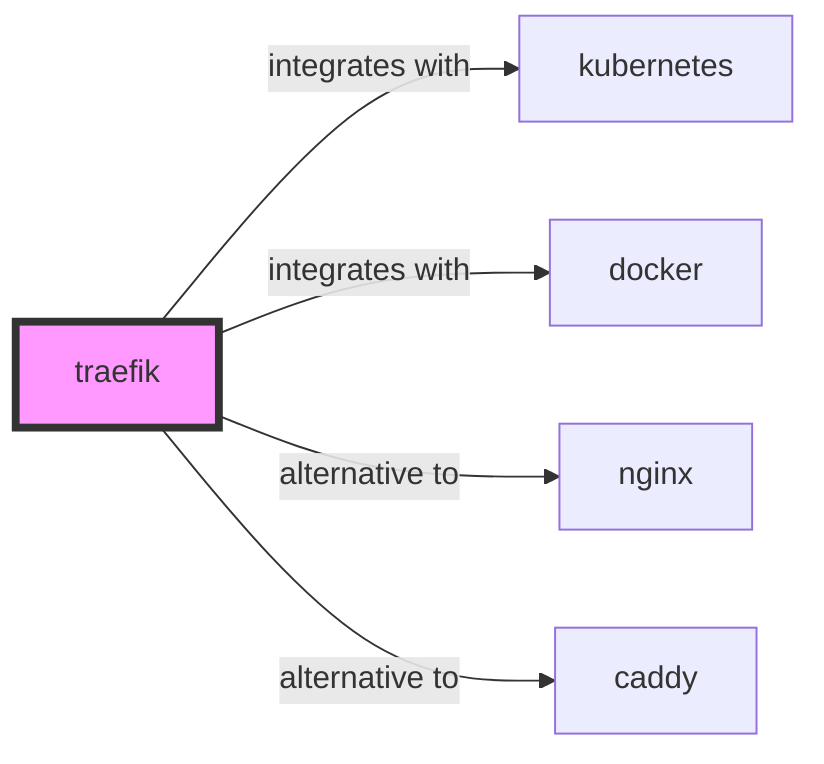

# Traefik Skill

> The Cloud Native Application Proxy.

## Ecosystem Graph Preview



## Recommended Next Skills

- **[nginx](/skills/nginx)** (Score: 0.95)
  *Why: Direct relationship, Both are Infrastructure, Shared ecosystem (devops), Can deploy to kubernetes, Similar network profile*
- **[caddy](/skills/caddy)** (Score: 0.94)
  *Why: Direct relationship, Both are Infrastructure, Shared ecosystem (devops), Can deploy to docker, Similar network profile*
- **[docker](/skills/docker)** (Score: 0.93)
  *Why: Direct relationship, Both are Infrastructure, Shared ecosystem (devops), Can deploy to kubernetes, Similar network profile*

## Quick Start
Traefik is a dynamic reverse proxy. It automatically discovers services running in Docker or Kubernetes and routes traffic to them without requiring manual configuration reloads.

```bash
docker-compose up -d
```

## Production Patterns
### Docker Label Routing
When running a Docker Swarm or Compose cluster, you do not write Traefik configuration files. You simply attach labels to your application containers (`traefik.http.routers.my-app.rule=Host('example.com')`). Traefik dynamically detects the container and routes traffic.

## Architecture & Scaling
### Kubernetes Ingress
Traefik natively implements the Kubernetes Ingress specification. It seamlessly reads your Ingress objects or custom IngressRoute CRDs and dynamically updates its routing table.

## Error Recovery
Traefik includes an internal dashboard on port 8080. If routes are failing (404), check the dashboard to ensure Traefik has successfully discovered the container and parsed the routing rule correctly.

## Security Notes
Traefik supports automatic Let's Encrypt generation. When running multiple Traefik replicas in Kubernetes, you must use a distributed key-value store (like Consul) to store the TLS certificates, otherwise replicas will hit ACME rate limits.

## References
- [Traefik Docs](https://doc.traefik.io/traefik/)

## Why use this skill
Use this when your agent works with **traefik** — structured patterns beat pasted docs and prevent common hallucinations.

## AI pitfalls
- Hardcoding region or account IDs
- Missing IAM least-privilege on cloud resources
- Confusing similar service names (e.g. S3 vs CloudFront)

## Production checklist
- [ ] Secrets in environment variables, not source code
- [ ] Error handling and logging in place
- [ ] Rate limits and timeouts configured

## Related skills
- [`kubernetes`](../kubernetes/SKILL.md) — integrates with
- [`docker`](../docker/SKILL.md) — integrates with
- [`nginx`](../nginx/SKILL.md) — alternative to
- [`caddy`](../caddy/SKILL.md) — alternative to
