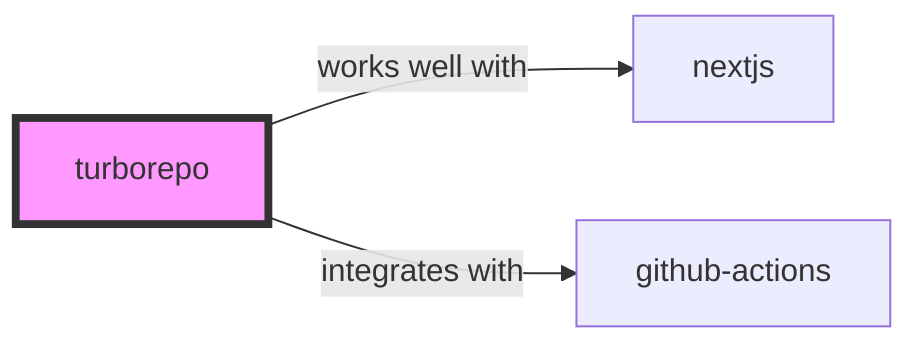

# TurboRepo Skill

> High-performance build system for JavaScript and TypeScript codebases.

## Ecosystem Graph Preview



## Recommended Next Skills

- **[github-actions](/skills/github-actions)** (Score: 0.7)
  *Why: Direct relationship, Both are Developer Tools*
- **[nextjs](/skills/nextjs)** (Score: 0.6)
  *Why: Direct relationship, Can deploy to vercel*
- **[playwright](/skills/playwright)** (Score: 0.4)
  *Why: Both are Developer Tools, Shared ecosystem (javascript), Similar network profile*

## Quick Start
TurboRepo is a build system for monorepos. It caches the output of tasks (like `build` or `test`) locally and remotely, meaning you never compile the same code twice.

```bash
npx create-turbo@latest
```

## Production Patterns
### Remote Caching
The true power of TurboRepo unlocks when you enable Remote Caching (via Vercel or a custom server). If Developer A builds the `ui` package on their laptop, Developer B instantly downloads the cached build rather than compiling it.

## Architecture & Scaling
### Task Graph
TurboRepo reads your `turbo.json` pipeline to understand dependencies. For example, it knows `apps/web:build` depends on `packages/ui:build`, and it orchestrates these tasks across maximum CPU cores automatically.

## Error Recovery
If the cache behaves weirdly (e.g., passing tests that should fail), it means your cache inputs (like environment variables) aren't strictly defined. Ensure all required env vars are listed in `dependsOn` in `turbo.json`.

## Security Notes
Never cache tasks that inject sensitive secrets into build artifacts unless you are absolutely sure who has read access to your Remote Cache.

## References
- [TurboRepo Docs](https://turbo.build/repo/docs)

## Why use this skill
Use this when your agent works with **turborepo** — structured patterns beat pasted docs and prevent common hallucinations.

## AI pitfalls
- Referencing CLI flags or config keys that do not exist
- Using outdated major versions of tools
- Skipping lockfile or version pinning in examples

## Production checklist
- [ ] Secrets in environment variables, not source code
- [ ] Error handling and logging in place
- [ ] Rate limits and timeouts configured

## Related skills
- [`nextjs`](../nextjs/SKILL.md) — works well with
- [`github-actions`](../github-actions/SKILL.md) — integrates with
