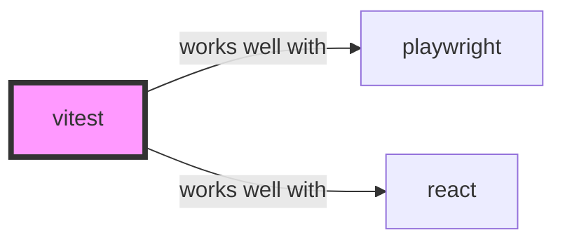

# Vitest Skill

> Next generation testing framework powered by Vite.

## Ecosystem Graph Preview



## Recommended Next Skills

- **[playwright](/skills/playwright)** (Score: 0.85)
  *Why: Direct relationship, Both are Testing, Shared ecosystem (javascript), Logical next step*
- **[react](/skills/react)** (Score: 0.65)
  *Why: Direct relationship, Shared ecosystem (javascript), Logical next step*
- **[biome](/skills/biome)** (Score: 0.4)
  *Why: Both are Developer Tools, Shared ecosystem (javascript), Can deploy to any*

## Quick Start
Vitest is a blazing fast unit test framework powered by Vite. It is a drop-in replacement for Jest but significantly faster as it shares the same configuration and transformation pipeline as Vite.

```bash
npm install -D vitest
```

## Production Patterns
### Setup Files
Instead of importing `beforeEach` and `describe` manually in every test file, you can enable `globals: true` in your `vitest.config.ts`. Use a `setupFiles` array to mock global browser APIs (like `fetch` or `localStorage`) before any tests run.

## Architecture & Scaling
### Worker Threads
Vitest runs tests in isolated worker threads. This prevents global state mutations in one test from leaking and corrupting another test. This parallel execution is why Vitest is so fast.

## Error Recovery
If tests randomly timeout in CI but pass locally, it is likely because your CI pipeline has significantly fewer CPU cores than your M-series MacBook. Use `poolOptions: { threads: { maxThreads: 2 } }` in CI to prevent thrashing.

## Security Notes
Tests often require API keys. Never commit real API keys to `.env.test`. Always use `msw` (Mock Service Worker) to intercept network requests at the network level and return stubbed JSON responses, guaranteeing your test suite never hits real infrastructure.

## References
- [Vitest Docs](https://vitest.dev/guide/)

## Why use this skill
Use this when your agent works with **vitest** — structured patterns beat pasted docs and prevent common hallucinations.

## AI pitfalls
- Referencing CLI flags or config keys that do not exist
- Using outdated major versions of tools
- Skipping lockfile or version pinning in examples

## Production checklist
- [ ] Secrets in environment variables, not source code
- [ ] Error handling and logging in place
- [ ] Rate limits and timeouts configured

## Related skills
- [`playwright`](../playwright/SKILL.md) — works well with
- [`react`](../react/SKILL.md) — works well with
