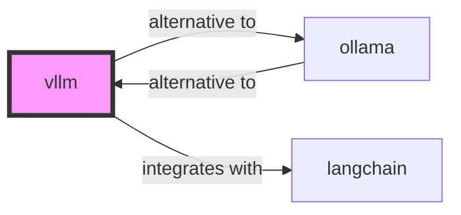

# vLLM Skill

> High-throughput and memory-efficient LLM inference engine.

## Ecosystem Graph Preview



## Recommended Next Skills

- **[ollama](/skills/ollama)** (Score: 0.92)
  *Why: Direct relationship, Both are AI, Shared ecosystem (ai), Can deploy to docker, Similar network profile*
- **[langchain](/skills/langchain)** (Score: 0.82)
  *Why: Direct relationship, Both are AI, Shared ecosystem (ai), Similar network profile*
- **[llamaindex](/skills/llamaindex)** (Score: 0.33)
  *Why: Both are AI, Shared ecosystem (ai), Similar network profile*

## Quick Start
vLLM is designed for high-concurrency production deployments. It uses PagedAttention to efficiently manage attention key-value memory, increasing throughput by up to 24x compared to HuggingFace Transformers.

```bash
pip install vllm
python -m vllm.entrypoints.openai.api_server --model meta-llama/Llama-2-7b-chat-hf
```

## Production Patterns
### PagedAttention
LLMs generate output token-by-token, causing massive fragmentation in GPU memory. vLLM solves this by treating VRAM like an OS virtual memory page table, drastically increasing the batch size of concurrent user requests.

## Architecture & Scaling
### OpenAI API Compatibility
vLLM runs an API server that perfectly matches the OpenAI specification. You can instantly replace your expensive OpenAI endpoint with a self-hosted vLLM endpoint without changing any client code.

## Error Recovery
If vLLM fails to start with Out of Memory errors, reduce the `gpu_memory_utilization` flag (default is 0.90) to reserve more VRAM for the PyTorch runtime overhead.

## Security Notes
vLLM does not include production authentication mechanisms. You must place it behind a reverse proxy (like NGINX or Traefik) and handle API Key validation at the proxy layer.

## References
- [vLLM Docs](https://vllm.readthedocs.io/)

## Why use this skill
Use this when your agent works with **vllm** — structured patterns beat pasted docs and prevent common hallucinations.

## AI pitfalls
- Using deprecated model IDs or wrong API endpoints
- Confusing chat vs completions vs embeddings APIs
- Omitting rate-limit and token budget handling

## Production checklist
- [ ] Secrets in environment variables, not source code
- [ ] Error handling and logging in place
- [ ] Rate limits and timeouts configured

## Related skills
- [`ollama`](../ollama/SKILL.md) — alternative to
- [`langchain`](../langchain/SKILL.md) — integrates with
